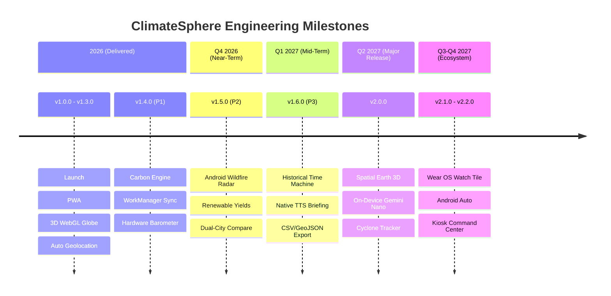

# 🗺️ ClimateSphere — Future Roadmap & Strategic Milestones

> **Current Version**: `v1.4.0` (Android Code 5 · Web Cloudflare)  
> **Repository**: [cyberlog69/climate-control](https://github.com/cyberlog69/climate-control)  
> **Last Updated**: September 2026  

---

## 🧭 Strategic Vision & Architecture Pillars

ClimateSphere's mission is to be the **most accessible, zero-cost, telemetry-driven planetary environmental sentinel** across Web and Native Android platforms. Every roadmap milestone is driven by four foundational pillars:

| Pillar | Focus | Target Outcome |
|---|---|---|
| 🛰️ **Open Planetary Telemetry** | Zero-API-key open science | 100% free data via Open-Meteo, NASA FIRMS, and public satellites |
| ⚡ **Cross-Platform Parity** | Web & Android alignment | Bring full Web scientific diagnostics into native Compose/Android |
| 🔒 **Edge & Offline First** | On-device sensors & caching | Hardware barometer storm alerts, Room SQLite persistence, 0ms cold starts |
| 🌍 **Actionable Climate Action** | Real-world personal impact | Scientific $\text{CO}_2$ mitigation, renewable yield modeling, disaster warnings |

---

## 📅 Roadmap Overview (2026 – 2027)

---

## 🚀 v1.5.0 — "Satellite Radar & Renewable Yields" _(P2 Milestone · Q4 2026)_

### 🎯 Primary Objective: Close Core Diagnostic Feature Gap on Android
With the **P1 Milestone** (Carbon Engine, WorkManager Sync, Hardware Barometer) successfully delivered in `v1.4.0`, `v1.5.0` focuses on porting the web app's satellite wildfire telemetry and clean energy diagnostics to Jetpack Compose.

#### 🛰️ Android Satellite & Wildfire Telemetry
- **NASA FIRMS Integration in Android**: Direct Retrofit client for NASA FIRMS orbital thermal telemetry (MODIS Aqua/Terra, VIIRS SNPP, NOAA-20).
- **Native Hotspot Radar Card**:
  - Distance computation to the nearest active wildfire cluster ($\text{km}$).
  - Fire Radiative Power (FRP in Megawatts) and brightness temperature (°C) badge.
  - Proximity hazard index calculation (Low $\rightarrow$ Extreme).
- **MapLibre / OSM Compose Map**: Interactive native vector map overlay rendering pulsating fire clusters and thermal risk zones.

#### ⚡ Renewable Energy Estimator (Native Android)
- **Solar PV Production Model**:
  - Peak Sun Hours (PSH) and Global Horizontal Irradiance (GHI in $\text{W/m}^2$).
  - Configurable solar array capacity slider ($1\text{ kWp} - 15\text{ kWp}$) with real-time annual yield ($\text{MWh/year}$).
  - Estimated electric utility bill savings ($/year) and avoided $\text{CO}_2\text{e}$ emissions.
- **Wind Kinetic Density Calculator**:
  - $50\text{m}$ hub-height wind shear scaling ($\frac{1}{2}\rho v^3$).
  - Micro-turbine capacity factor evaluation.
- **Diurnal Generation Curves**: Custom Jetpack Compose Canvas area chart showing daytime solar production curve vs. nocturnal wind spikes.

#### ⚔️ Dual-City Comparison Mode (Android)
- **Side-by-Side Analysis Sheet**: Search and compare telemetry between GPS location and any global city simultaneously.
- **Environmental Delta Indicators**: Live temperature differential ($\Delta^\circ\text{C}$), AQI gap, wind speed variance, and barometric gradient.

#### 🔮 Climate Impact Simulator (Android)
- **+1.5°C to +4.0°C Global Warming Slider**: Port the web scenario simulator to Compose.
- **Local Stress Projections**: Sea level inundation surge, additional annual heatwave days ($>35^\circ\text{C}$), and agricultural drought index.

---

## 🌟 v1.6.0 — "Time Machine & Voice Intelligence" _(P3 Milestone · Q1 2027)_

### 🎯 Primary Objective: Planetary History & Hands-Free Audio Briefings

#### ⏳ 75-Year Historical Climate Time Machine (1950 – 2026)
- **Android Historical Decade Scrubber**:
  - Scrub across decades ($1950 \rightarrow 2026$) with animated thermal shifts.
  - Atmospheric $\text{CO}_2$ concentration benchmarks ($311\text{ ppm} \rightarrow 428\text{ ppm}$).
  - Long-term mean temperature and extreme heatwave day frequency progression.
- **Interactive High-Performance Charting**: Vico or custom Canvas trajectory curves with pinpointed current-decade anomalies.

#### 🎙️ Native Android TTS Climate Briefing
- **Android `TextToSpeech` Engine Integration**:
  - Zero-cloud speech synthesis generating executive daily climate and air quality briefings.
  - Pitch, speech rate, and locale accent selectors.
- **Animated Audio Equalizer Visualizer**: Jetpack Compose animated canvas bars synchronized with TTS speech utterance state.

#### 📥 Raw Research Data Exporter (Android & Web)
- **Storage Access Framework (SAF) Exporter**: Export complete multi-stream climate datasets formatted in standard **RFC-4180 CSV** or **GeoJSON** directly to Android device storage or Google Drive.
- **Dataset Streams**: Hourly forecast, 7-day synoptic weather, air quality PM2.5/PM10, NASA wildfire clusters, and historical time-series.

#### 🔊 Procedural Ambient Weather Synthesizer (Android)
- **`AudioTrack` / Oboe Procedural Audio Engine**: Low-latency procedural sound generation simulating falling rain, atmospheric wind howls, and thunderstorm rumbles based on current sensor conditions without audio asset downloads.

---

## 🪐 v2.0.0 — "Spatial Earth & On-Device AI Sentinel" _(Major Release · Q2 2027)_

### 🎯 Primary Objective: Photorealistic 3D Planetary Graphics & Edge AI

> [!IMPORTANT]
> All AI advisory features will leverage on-device models (**Android AICore / Gemini Nano** on supported Android 15+ devices, and **WebLLM** in browser) to preserve complete user privacy and maintain 100% free operation with zero server subscription costs.

#### 🌐 3D WebGL Earth Globe 2.0 (Web)
- **Custom Atmospheric Shaders**: Photorealistic Rayleigh and Mie atmospheric scattering GLSL shaders with golden sunrise/sunset limb lighting.
- **Dynamic Night-Lights Layer**: NASA Black Marble city lights texture activated dynamically on the nocturnal hemisphere.
- **Volumetric Procedural Cloud System**: Animated multi-altitude cloud layers with real-time ground shadow raycasting.
- **Thermal Heatmap Surface Shading**: Direct WebGL surface texture color-mapping displaying real-time global land-surface temperature gradients.

#### 🤖 On-Device Climate AI Assistant (Gemini Nano & WebLLM)
- **Context-Grounded Climate Q&A**: Ask natural language questions grounded directly on active telemetry:
  - *"Why is the AQI hazardous today despite zero local traffic?"* $\rightarrow$ Correlates regional NASA wildfire smoke plumes.
  - *"How does today's rainfall compare to historical 1970 averages?"* $\rightarrow$ Queries local historical ERA5 database records.
- **Actionable Home Energy Guidance**: Generates personalized HVAC and solar panel efficiency recommendations based on upcoming 48-hour solar irradiance and temperature swings.

#### 🌀 Live Storm & Cyclone Tracker
- **Real-Time Doppler Radar Animation**: Animated precipitation radar overlay tiles across North America, Europe, East Asia, and Australia.
- **Global Tropical Cyclone Monitoring**: Live storm trajectory forecasts and cone-of-uncertainty tracking from JTWC (Joint Typhoon Warning Center) and NHC (National Hurricane Center).

---

## ⌚ v2.1.0 — "Wearable & Connected Ecosystem" _(Q3 2027)_

### 🎯 Primary Objective: Wrist-Worn Monitoring & Automotive Safety

#### ⌚ Wear OS Companion Application (`:wearApp`)
- **Ambient AQI & Temp Complications**: Circular and corner complications for any Wear OS watch face showing live temperature and AQI color ring.
- **Severe Weather Watch Tile**: Glanceable Wear OS Tile showing nearest wildfire distance, storm warnings, and daily precipitation probability.
- **Haptic Emergency Warnings**: Distinctive wrist vibrations when rapid barometric drops indicate incoming storms or dangerous AQI spikes occur.

#### 🚗 Android Auto Integration
- **Automotive Environmental Dashboard**: Low-distraction dashboard display for in-vehicle infotainment screens.
- **Route Hazard Warnings**: Alerts drivers when navigating toward hazardous AQI zones, severe hail/wind storms, or high-risk wildfire corridors.

---

## 🖥️ v2.2.0 — "Control Room & Scientific Kiosk" _(Q4 2027)_

#### 🖥️ Multi-Monitor Kiosk & Control Room Mode
- **Ultrawide & Dual-Display Layout**: Tailored for research labs, science classrooms, and environmental monitoring control rooms.
- **Auto-Cycling Sentinel**: Automatically cycles between 3D Earth Globe, NASA satellite wildfire radar, historical time-lapse, and renewable energy grids on configurable intervals.
- **Offline Local Hub Server**: Embedded lightweight HTTP server mode for local school/office network broadcasting.

---

## 🛠️ Ongoing Architecture & Engineering Standards

| Area | Current Status (v1.4.0) | Target Standard |
|---|---|---|
| **Android Architecture** | Clean Arch + Manual `AppContainer` DI | Standardize with Koin or Hilt for dependency injection scaling |
| **Room Migrations** | Schema v3 with `fallbackToDestructiveMigration` | Implement strict, automated `Migration(1, 2)`, `Migration(2, 3)` with schema export verification |
| **Unit & Integration Testing** | Unit tests for `CarbonCalculatorTest` | Expand test coverage to 80%+ with MockWebServer and Compose UI tests |
| **Containerization** | Rootless Podman, Compose, Quadlet systemd | Automated multi-arch container image builds (`linux/amd64`, `linux/arm64`) pushed to GHCR |
| **CI/CD Automation** | Manual Gradle release builds | GitHub Actions workflow for automated Android APK signing and GitHub Releases deployment |

---

## 📊 Milestone Summary Table

| Milestone | Theme | Target Date | Key Deliverables |
|---|---|---|---|
| **v1.4.0 (P1)** | Hardware & Carbon | Delivered | Carbon Calculator, WorkManager sync, Barometer storm alerts |
| **v1.5.0 (P2)** | Satellite & Energy Parity | Q4 2026 | NASA Wildfire radar in Android, Renewable Energy model, Dual-City |
| **v1.6.0 (P3)** | Time Machine & Voice | Q1 2027 | 75-Yr Historical Time Machine, Native Android TTS briefing, SAF Export |
| **v2.0.0** | Spatial Earth & Edge AI | Q2 2027 | 3D WebGL shaders, On-device Gemini Nano Q&A, Doppler cyclone radar |
| **v2.1.0** | Wearables & Auto | Q3 2027 | Wear OS Tile/Complications, Android Auto environmental hazard mode |
| **v2.2.0** | Control Room Kiosk | Q4 2027 | Ultrawide command center mode, multi-display auto-cycling kiosk |
